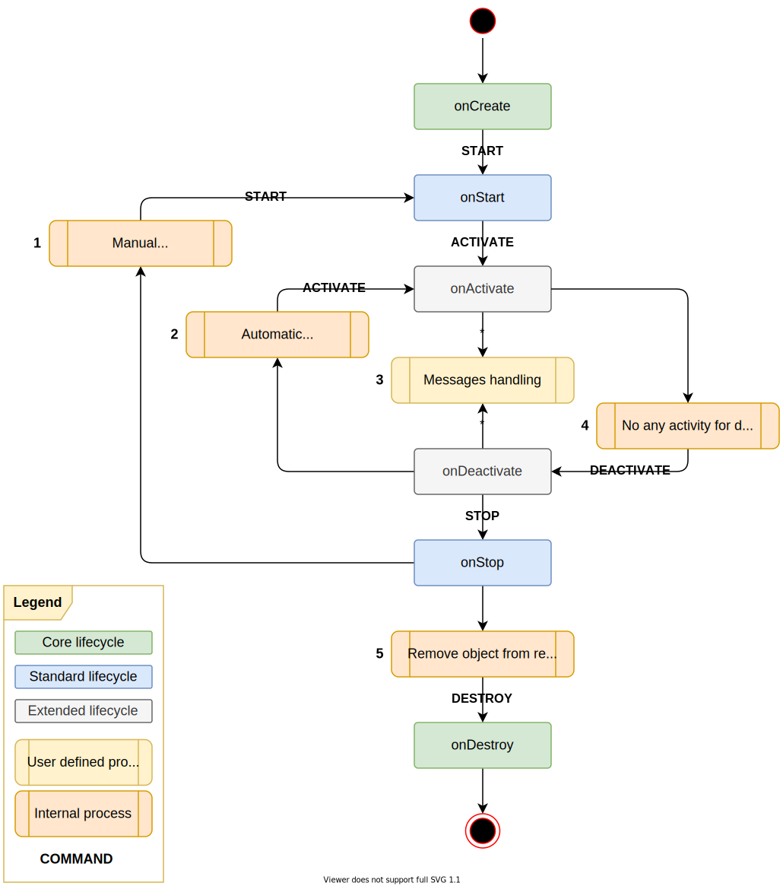

# Process · Active Objects · [ActO]

An implementation variant of Active Objects with the following features:

- **Asynchronous Method Calls**: Methods are executed asynchronously, allowing the caller to continue executing other tasks.
- **Thread Safety**: Ensures that method calls are thread-safe and do not interfere with each other.
- **Request Queue Management**: Efficiently manages the request queue to ensure that requests are processed in the correct order.
- **Dependency Control**: Ensures strong dependency control between objects.
- **Customizable Lifecycles**: Allows customization of object lifecycles, including initialization and termination.
- **Single Dispatcher**: Uses a single dispatcher to manage all active objects.

## Example

Create and send message (`getCounter`) to an [EchoObject](core/src/test/java/com/github/devmix/process/acto/fixtures/EchoObject.java) / [EchoOptions](core/src/test/java/com/github/devmix/process/acto/fixtures/EchoOptions.java):

```java
final var dispatcher = new DefaultActiveObjectsDispatcher();

ActiveObject<EchoObject> obj = dispatcher
        .create(EchoObject::new, "object-id", new EchoOptions(false, 0));

Long counter = obj.get(EchoObject::getCounter).get();
```

## Object Lifecycle



### Usage Examples


- **User Interface**: Provides access to the data table from the user interface.
- **Data Table**: Represents the data table that can be in different states (e.g., migration, creation, deletion, etc.).
  It depends on the Data Source.
- **Data Source**: Represents the data source that can be in different states (e.g., creation, connecting, closed,
  etc.). It depends on the Data Table and interacts with external resources such as databases or file systems.

The **Data Table** and **Data Source** are active objects that can be in different states. The main problem we need to
solve is how to manage their lifecycles and dependencies, ensuring proper initialization of the **Data Source** before
the **Data Table** is used.

More complex example with ETL pipeline:


- **User Interface**: Provides access to the pipeline from the user interface.
- **Pipeline**: Represents a data processing pipeline that can be in different states (e.g., running, paused, stopped,
  etc.). It depends on the **Source Endpoint**, **Transformer**, and **Target Endpoint**.
- **Source Endpoint**: Represents a source endpoint that can be in different states (e.g., connecting, connected,
  disconnected, etc.). It interacts with external resources such as databases or file systems.
- **Transformer**: Represents a transformer that can be in different states (e.g., processing, paused, stopped, etc.).
  It depends on internal scripts or services.
- **Target Endpoint**: Represents a target endpoint that can be in different states (e.g., connecting, connected,
  disconnected, etc.). It interacts with external resources such as databases or file systems.

The **Pipeline**, **Source Endpoint**, **Transformer**, and **Target Endpoint** are active objects.

## Synthetic Example

[ReadmeExample.java](core/src/test/java/com/github/devmix/process/acto/ReadmeExample.java)

```java
public class ReadmeExample {

    // Define the number of threads for concurrent testing
    public static final int THREADS = 10;

    // Define the number of messages to be sent during load test
    public static final int MESSAGES = 100_000;

    public static void main(final String[] args) throws ExecutionException, InterruptedException, IOException, TimeoutException {
        // Enable debugging information for the DefaultActiveObjectContext
        DefaultActiveObjectContext.DEBUGGING_INFO = true;

        // Create an instance of the Active Objects dispatcher
        final var r = new DefaultActiveObjectsDispatcher();

        // Register factories for NodeObject and HelloWorldObject classes
        r.registerFactory(NodeObject.class, new NodeFactory());
        r.registerFactory(HelloWorldObject.class, HelloWorldObject::new);

        // Create instances of NodeObject with specific configurations
        final var o1 = r.create(NodeObject.class, "n:1", new NodeOptions("data-1", new String[]{"n:2"}, null));
        final var o2 = r.create(NodeObject.class, "n:2", new NodeOptions("data-2", new String[]{"n:3"}, null));
        final var o3 = r.create(NodeObject.class, "n:3", new NodeOptions("data-3", new String[]{"n:4", "n:5"}, new String[]{"n:6"}));
        final var o4 = r.create(NodeObject.class, "n:4", new NodeOptions("data-4", null, null));
        final var o5 = r.create(NodeObject.class, "n:5", new NodeOptions("data-5", null, null));
        final var o6 = r.create(NodeObject.class, "n:6", new NodeOptions("data-6", null, null));

        // Create an instance of SomeFileSystemObject with a specified file path
        final var o7 = r.create(SomeFileSystemObject::new, "fs:1", "/tmp");

        // Get the list of files from the file system object and print them to the console
        o7.get(SomeFileSystemObject::getFilesList).thenAccept(System.out::println);

        // Send a HELLO message from NodeObject 'o1' and print the response
        System.out.println(o1.request(NodeObject.MSG_HELLO).get());

        // Send a broadcast STOP force message to NodeObject 'o5'
        o5.request(Stop.force()).get();

        // Send two HELLO messages to NodeObject 'o6' without expecting a reply
        o6.requestAndForget(NodeObject.MSG_HELLO);
        o6.requestAndForget(NodeObject.MSG_HELLO);

        // Get the counter from NodeObject 'o6' and print the response
        o6.get(NodeObject::getCounter).thenAccept(response -> {
            System.out.println(response);
        });

        // Print the string representation of NodeObjects 'o1' and 'o6'
        System.out.println(o1);
        System.out.println(o6);

        // Perform a load test on NodeObject 'o6' with multiple threads sending HELLO messages
        load(o6);

        // Get the counter from NodeObject 'o6' after the load test and print the response
        System.out.println(o6.get(NodeObject::getCounter).get());
    }

    /**
     * Perform a stress test on an ActiveObject by sending a large number of HELLO messages concurrently
     */
    private static void load(final ActiveObject<?> object) throws InterruptedException, ExecutionException, TimeoutException {
        // Create a fixed thread pool with the specified number of threads
        final var executor = Executors.newFixedThreadPool(THREADS);

        // Initialize two CountDownLatch instances for synchronization purposes
        final var startSignal = new CountDownLatch(THREADS + 1);
        final var doneSignal = new CountDownLatch(1);

        // Submit tasks to the thread pool that will send HELLO messages to the target object
        for (var threadIndex = 0; threadIndex < THREADS; threadIndex++) {
            executor.submit(() -> {
                startSignal.countDown();
                try {
                    // Wait for all threads to be ready before starting the test
                    startSignal.await();
                } catch (final InterruptedException e) {
                    return;
                }

                // Send HELLO messages to the target object in a loop
                for (var msgIndex = 0; msgIndex < MESSAGES; msgIndex++) {
                    object.request(NodeObject.MSG_HELLO);
                }
                // Notify that this thread has completed sending HELLO messages
                doneSignal.countDown();
            });
        }

        // Notify all threads to start the test by counting down the latch
        startSignal.countDown();

        // Wait for all threads to be ready before starting the timer
        startSignal.await();

        // Record the start time of the test
        final var now = System.nanoTime();

        // Wait for all threads to complete sending HELLO messages
        doneSignal.await();

        // Shutdown the executor service after the test is completed
        executor.shutdown();

        // Wait for all pending tasks in the target object's queue to be processed
        ((ActiveObjectContext) object).awaitEmptyQueue(5, TimeUnit.MINUTES);

        // Print the duration of the test in milliseconds
        System.out.println("finished in " + TimeUnit.NANOSECONDS.toMillis(System.nanoTime() - now) + " msec");
    }
}    
```

Output:
```
// ----------------------------------------------------------------------------
// objects initialization
// ----------------------------------------------------------------------------

[main] INFO com.github.devmix.process.acto.core.context.DefaultActiveObjectContext - CREATE ⟶ ⟶ [
id:n:1, status:CREATING]
[main] INFO com.github.devmix.process.acto.core.context.DefaultActiveObjectContext - ⟵ ⟵ CREATE [
id:n:1, status:CREATED, dependencies:
n:2 - type:DEPENDS_ON, resolved:false, optional:false
]
[main] INFO com.github.devmix.process.acto.core.context.DefaultActiveObjectContext - CREATE ⟶ ⟶ [
id:n:2, status:CREATING]
[main] INFO com.github.devmix.process.acto.core.context.DefaultActiveObjectContext - ⟵ ⟵ CREATE [
id:n:2, status:CREATED, dependencies:
n:3 - type:DEPENDS_ON, resolved:false, optional:false
]
[main] INFO com.github.devmix.process.acto.core.context.DefaultActiveObjectContext - CREATE ⟶ ⟶ [
id:n:3, status:CREATING]
[main] INFO com.github.devmix.process.acto.core.context.DefaultActiveObjectContext - ⟵ ⟵ CREATE [
id:n:3, status:CREATED, dependencies:
n:5 - type:DEPENDS_ON, resolved:false, optional:false
n:4 - type:DEPENDS_ON, resolved:false, optional:false
n:6 - type:DEPENDS_ON, resolved:false, optional:true
]
[main] INFO com.github.devmix.process.acto.core.context.DefaultActiveObjectContext - CREATE ⟶ ⟶ [
id:n:4, status:CREATING]
[main] INFO com.github.devmix.process.acto.core.context.DefaultActiveObjectContext - ⟵ ⟵ CREATE [
id:n:4, status:CREATED]
[main] INFO com.github.devmix.process.acto.core.context.DefaultActiveObjectContext - CREATE ⟶ ⟶ [
id:n:5, status:CREATING]
[main] INFO com.github.devmix.process.acto.core.context.DefaultActiveObjectContext - ⟵ ⟵ CREATE [
id:n:5, status:CREATED]
[main] INFO com.github.devmix.process.acto.core.context.DefaultActiveObjectContext - CREATE ⟶ ⟶ [
id:n:6, status:CREATING]
[main] INFO com.github.devmix.process.acto.core.context.DefaultActiveObjectContext - ⟵ ⟵ CREATE [
id:n:6, status:CREATED]
[main] INFO com.github.devmix.process.acto.core.context.DefaultActiveObjectContext - CREATE ⟶ ⟶ [
id:fs:1, status:CREATING]
[main] INFO com.github.devmix.process.acto.core.context.DefaultActiveObjectContext - ⟵ ⟵ CREATE [
id:fs:1, status:CREATED]

// ----------------------------------------------------------------------------
// o7.get(SomeFileSystemObject::getFilesList).thenAccept(System.out::println);
// ----------------------------------------------------------------------------
        
[ForkJoinPool-1-worker-2] INFO com.github.devmix.process.acto.core.context.DefaultActiveObjectContext - START ⟶ ⟶ C:[] [
id:fs:1, status:CREATED]
[ForkJoinPool-1-worker-2] INFO com.github.devmix.process.acto.core.context.DefaultActiveObjectContext - ⟵ ⟵ START C:[fs:1] [
id:fs:1, status:STARTED]
        
file 1
...
file N

// ----------------------------------------------------------------------------
// System.out.println(o1.request(NodeObject.MSG_HELLO).get());
// ----------------------------------------------------------------------------
        
[ForkJoinPool-1-worker-3] INFO com.github.devmix.process.acto.core.context.DefaultActiveObjectContext - START ⟶ ⟶ C:[] [
id:n:1, status:CREATED, dependencies:
n:2 - type:DEPENDS_ON, resolved:false, optional:false
]
[ForkJoinPool-1-worker-4] INFO com.github.devmix.process.acto.core.context.DefaultActiveObjectContext - START ⟶ ⟶ C:[n:1] [
id:n:2, status:CREATED, dependencies:
n:3 - type:DEPENDS_ON, resolved:false, optional:false
]
[ForkJoinPool-1-worker-5] INFO com.github.devmix.process.acto.core.context.DefaultActiveObjectContext - START ⟶ ⟶ C:[n:1 > n:2] [
id:n:3, status:CREATED, dependencies:
n:5 - type:DEPENDS_ON, resolved:false, optional:false
n:4 - type:DEPENDS_ON, resolved:false, optional:false
n:6 - type:DEPENDS_ON, resolved:false, optional:true
]
[ForkJoinPool-1-worker-6] INFO com.github.devmix.process.acto.core.context.DefaultActiveObjectContext - START ⟶ ⟶ C:[n:1 > n:2 > n:3] [
id:n:5, status:CREATED]
[ForkJoinPool-1-worker-6] INFO com.github.devmix.process.acto.core.context.DefaultActiveObjectContext - ⟵ ⟵ START C:[n:1 > n:2 > n:3 > n:5] [
id:n:5, status:STARTED, dependencies:
n:3 - type:REQUIRED_FOR, resolved:true, optional:false
]
[ForkJoinPool-1-worker-8] INFO com.github.devmix.process.acto.core.context.DefaultActiveObjectContext - START ⟶ ⟶ C:[n:1 > n:2 > n:3 > n:5] [
id:n:4, status:CREATED]
[ForkJoinPool-1-worker-8] INFO com.github.devmix.process.acto.core.context.DefaultActiveObjectContext - ⟵ ⟵ START C:[n:1 > n:2 > n:3 > n:5 > n:4] [
id:n:4, status:STARTED, dependencies:
n:3 - type:REQUIRED_FOR, resolved:true, optional:false
]
[ForkJoinPool-1-worker-7] INFO com.github.devmix.process.acto.core.context.DefaultActiveObjectContext - START ⟶ ⟶ C:[n:1 > n:2 > n:3 > n:5 > n:4] [
id:n:6, status:CREATED]
[ForkJoinPool-1-worker-7] INFO com.github.devmix.process.acto.core.context.DefaultActiveObjectContext - ⟵ ⟵ START C:[n:1 > n:2 > n:3 > n:5 > n:4 > n:6] [
id:n:6, status:STARTED, dependencies:
n:3 - type:REQUIRED_FOR, resolved:true, optional:true
]
[ForkJoinPool-1-worker-5] INFO com.github.devmix.process.acto.core.context.DefaultActiveObjectContext - ⟵ ⟵ START C:[n:1 > n:2 > n:3 > n:5 > n:4 > n:6] [
id:n:3, status:STARTED, dependencies:
n:2 - type:REQUIRED_FOR, resolved:true, optional:false
n:5 - type:DEPENDS_ON, resolved:true, optional:false
n:4 - type:DEPENDS_ON, resolved:true, optional:false
n:6 - type:DEPENDS_ON, resolved:true, optional:true
]
[ForkJoinPool-1-worker-4] INFO com.github.devmix.process.acto.core.context.DefaultActiveObjectContext - ⟵ ⟵ START C:[n:1 > n:2 > n:3 > n:5 > n:4 > n:6] [
id:n:2, status:STARTED, dependencies:
n:1 - type:REQUIRED_FOR, resolved:true, optional:false
n:3 - type:DEPENDS_ON, resolved:true, optional:false
]
[ForkJoinPool-1-worker-3] INFO com.github.devmix.process.acto.core.context.DefaultActiveObjectContext - ⟵ ⟵ START C:[n:1 > n:2 > n:3 > n:5 > n:4 > n:6] [
id:n:1, status:STARTED, dependencies:
n:2 - type:DEPENDS_ON, resolved:true, optional:false
]

WORLD 1

// ----------------------------------------------------------------------------
// o5.request(Stop.force()).get();
// ----------------------------------------------------------------------------
        
[ForkJoinPool-1-worker-7] INFO com.github.devmix.process.acto.core.context.DefaultActiveObjectContext - STOP ⟶ ⟶ C:[] [
id:n:5, status:STARTED, dependencies:
n:3 - type:REQUIRED_FOR, resolved:true, optional:false
]
[ForkJoinPool-1-worker-8] INFO com.github.devmix.process.acto.core.context.DefaultActiveObjectContext - STOP ⟶ ⟶ C:[n:5] [
id:n:3, status:STARTED, dependencies:
n:2 - type:REQUIRED_FOR, resolved:true, optional:false
n:5 - type:DEPENDS_ON, resolved:true, optional:false
n:4 - type:DEPENDS_ON, resolved:true, optional:false
n:6 - type:DEPENDS_ON, resolved:true, optional:true
]
[ForkJoinPool-1-worker-4] INFO com.github.devmix.process.acto.core.context.DefaultActiveObjectContext - STOP ⟶ ⟶ C:[n:5 > n:3] [
id:n:2, status:STARTED, dependencies:
n:1 - type:REQUIRED_FOR, resolved:true, optional:false
n:3 - type:DEPENDS_ON, resolved:true, optional:false
]
[ForkJoinPool-1-worker-3] INFO com.github.devmix.process.acto.core.context.DefaultActiveObjectContext - STOP ⟶ ⟶ C:[n:5 > n:3 > n:2] [
id:n:1, status:STARTED, dependencies:
n:2 - type:DEPENDS_ON, resolved:true, optional:false
]
[ForkJoinPool-1-worker-3] INFO com.github.devmix.process.acto.core.context.DefaultActiveObjectContext - ⟵ ⟵ STOP C:[n:5 > n:3 > n:2 > n:1] [
id:n:1, status:STOPPED, dependencies:
n:2 - type:DEPENDS_ON, resolved:false, optional:false
]
[ForkJoinPool-1-worker-4] INFO com.github.devmix.process.acto.core.context.DefaultActiveObjectContext - ⟵ ⟵ STOP C:[n:5 > n:3 > n:2 > n:1] [
id:n:2, status:STOPPED, dependencies:
n:3 - type:DEPENDS_ON, resolved:false, optional:false
]
[ForkJoinPool-1-worker-8] INFO com.github.devmix.process.acto.core.context.DefaultActiveObjectContext - ⟵ ⟵ STOP C:[n:5 > n:3 > n:2 > n:1] [
id:n:3, status:STOPPED, dependencies:
n:5 - type:DEPENDS_ON, resolved:false, optional:false
n:4 - type:DEPENDS_ON, resolved:true, optional:false
n:6 - type:DEPENDS_ON, resolved:true, optional:true
]
[ForkJoinPool-1-worker-5] INFO com.github.devmix.process.acto.core.context.DefaultActiveObjectContext - REMOVE UPSTREAM DEP ⟶ ⟶ ID:n:3 [
id:n:4, status:STARTED, dependencies:
n:3 - type:REQUIRED_FOR, resolved:true, optional:false
]
[ForkJoinPool-1-worker-6] INFO com.github.devmix.process.acto.core.context.DefaultActiveObjectContext - REMOVE UPSTREAM DEP ⟶ ⟶ ID:n:3 [
id:n:6, status:STARTED, dependencies:
n:3 - type:REQUIRED_FOR, resolved:true, optional:true
]
[ForkJoinPool-1-worker-7] INFO com.github.devmix.process.acto.core.context.DefaultActiveObjectContext - ⟵ ⟵ STOP C:[n:5 > n:3 > n:2 > n:1] [
id:n:5, status:STOPPED]
[ForkJoinPool-1-worker-6] INFO com.github.devmix.process.acto.core.context.DefaultActiveObjectContext - ⟵ ⟵ REMOVED UPSTREAM DEP ID:n:3 [
id:n:6, status:STARTED]

// ----------------------------------------------------------------------------
// o6.requestAndForget(NodeObject.MSG_HELLO);
// ----------------------------------------------------------------------------

[ForkJoinPool-1-worker-5] INFO com.github.devmix.process.acto.core.context.DefaultActiveObjectContext - ⟵ ⟵ REMOVED UPSTREAM DEP ID:n:3 [
id:n:4, status:STARTED]

// ----------------------------------------------------------------------------
// o6.get(NodeObject::getCounter).thenAccept(response -> { System.out.println(response); });
// ----------------------------------------------------------------------------

3

// ----------------------------------------------------------------------------
// System.out.println(o1);
// ----------------------------------------------------------------------------
        
ActiveObjectContext{id=n:1, status=STOPPED, queue=0, running=false, deps=1}

// ----------------------------------------------------------------------------
// System.out.println(o6);
// ----------------------------------------------------------------------------
        
ActiveObjectContext{id=n:6, status=STARTED, queue=0, running=false, deps=0}

// ----------------------------------------------------------------------------
// load(o6);
// ----------------------------------------------------------------------------
        
finished in 1507 msec

// ----------------------------------------------------------------------------
// System.out.println(o6.get(NodeObject::getCounter).get());
// ----------------------------------------------------------------------------

total messages: 1000003

```