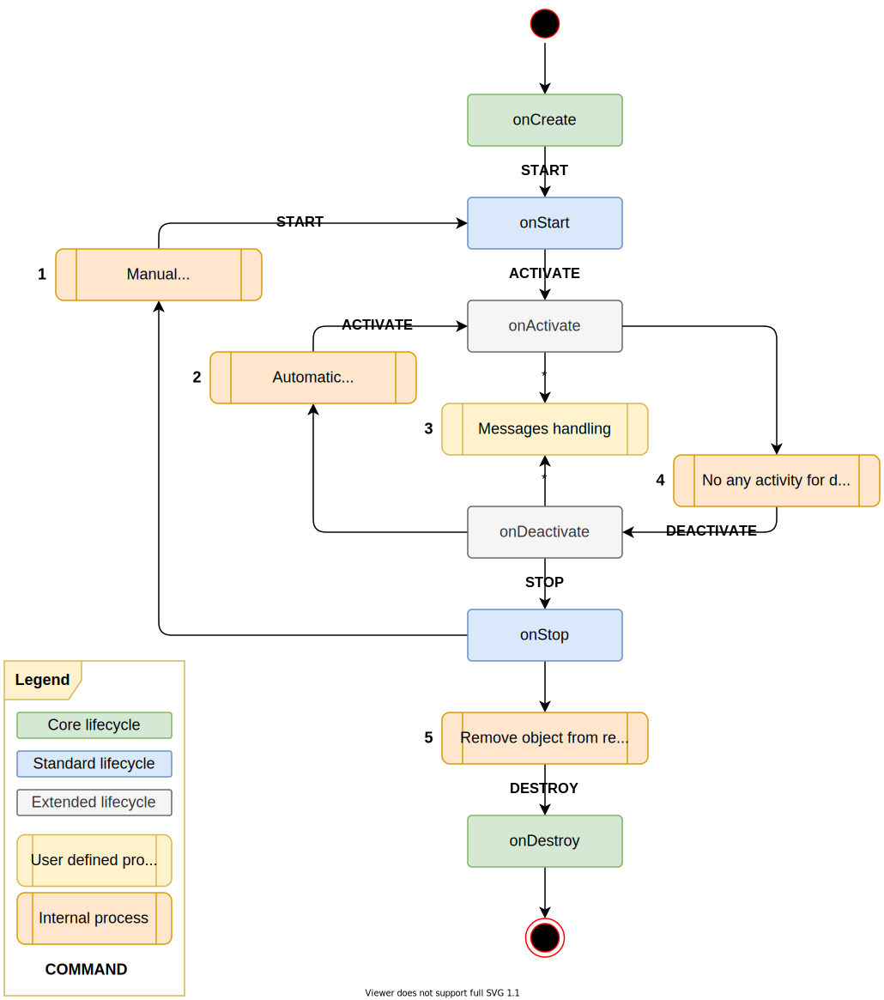

= ADR-0001: Active Objects Concept

[horizontal]
Status:: accepted
Deciders:: Sergey Grachev (link:mailto:sergey.grachev@yahoo.com[sergey.grachev@yahoo.com])
Date:: 2022.09.29
Technical Story:: _none_

== Context and Problem Statement

It is necessary to implement a complex object model with dependencies between objects and asynchronous communication between them.

== Decision Drivers

* Required for `devMix Data · Dynamic Objects (DynO)`.
`Data[Sources/Stores/Sets]` are active objects with internal state and dependencies between each other.
* Will be used for other projects, e.g. platform subsystems, pipeline processors (e.g. MDM, ETL)
* The active objects must have an internal lifecycle.
* This functional should be simple and fast, without extra large frameworks.

== Considered Options

* Akka
* Custom implementation

== Decision Outcome

Chosen option: "Custom implementation", because only option, which meets criterion decision driver.

=== Lifecycle

*States diagram*

*Classes diagram*

[plantuml]
----
include::assets/0001-classes.puml[]
----

=== Object naming

Object ID variant:

* Can be any object, except primitive types.
* MUST be unique.
* SHOULD implement equals() and hashCode() for complex POJO.

Example format of the string ID:

----
{type}:{id} - storage:401de5c0-6417-4b8a-8385-14a24e914a6a
----

* type - user defined type of the object
* id - internal object id

=== TODO

. Each Object has own dispatcher:
** single threaded
** all messages have been stored in the blocking queue
** started on demand, only if queue has messages (fork join pool)
. Steps:
.. Load and create all objects from database:
... status = CREATED
.. Initialize objects
... collect static dependencies
... status = IDLE
.. Send START:
... ACTIVE: ignore
... STOPPED: exception
... IDLE:
.... send START to all outgoing dependencies
.... wait for dependencies
.... store income dependency (in case current object has been started by another as dependency)
.... change status to ACTIVE
.... return result
.. Send <User Defined Message>:
... IDLE:
.... return <User Defined Message> to queue
.... add START to queue (tail)
.... next dispatcher cycle
... ACTIVE:
.... process message
.... return result
... STOPPED: exception
.. Send STOP:
... IDLE: update status
... ACTIVE:
.... send STOP to all incoming dependencies
.... wait for dependencies
.... remove income dependency (in case current object has been started by another as dependency)
.... change status to STOPPED
.... return result
... STOPPED: ignore
.. Send IDLE:
... IDLE: ignore
... ACTIVE:
.... send IDLE to all incoming dependencies
.... wait for dependencies
.... remove income dependency (in case current object has been started by another as dependency)
.... change status to IDLE
.... return result
... STOPPED: exception
. Two types of dependencies:
.. OUTGOING - object depends on
.. INCOMING - object required for
. Statuses:
.. IDLE
.. ACTIVE
.. STARTING
.. REMOVING
.. STOPPING

== Samples

*Sample objects dependencies*
[plantuml]

----
include::assets/0001-sequence-dependencies.puml[]
----

*Start object sequence*
[plantuml]

----
include::assets/0001-sequence-start.puml[]
----

*Stop object sequence*
[plantuml]

----
include::assets/0001-sequence-stop.puml[]
----